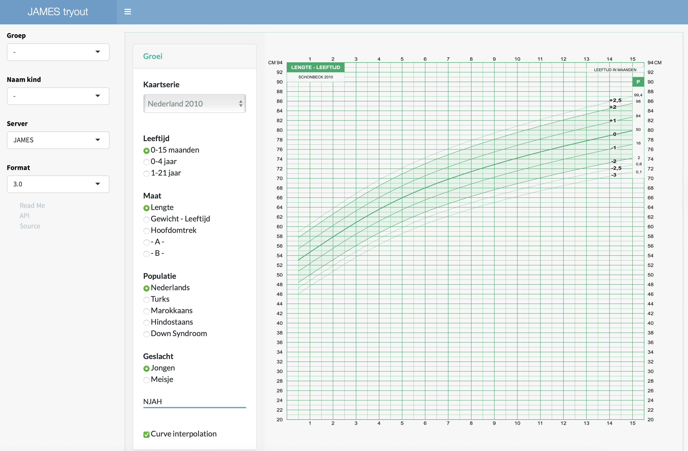

<!-- README.md is generated from README.Rmd. Please edit that file -->


```{r setup, include=FALSE}
knitr::opts_chunk$set(echo = TRUE, eval=FALSE)
```

# jamesdemo

The `jamesdemo` package contains a simple Shiny app that shows site functionality of the **Joint Automatic Measurement and Evaluation System (JAMES)**. The API endpoint `request_site` as defined by [james](https://github.com/growthcharts/james) returns an URL that points to a site with personalised child charts. The `jamesdemo` app shows the site for a set of demo children. The [jamesdemodata](https://github.com/growthcharts/jamesdemodata) package stores the data of these children.

## Installation

The following statements will install the `jamesdemo` package

```{r eval = FALSE}
install.packages("remotes")
remotes::install_github("growthcharts/jamesdemo")
```

## Example

Within RStudio, view the website locally as follows:

```{r}
library(jamesdemo)
go()
```

## Online version

You can spare yourself the trouble of installing the package, and visit `JAMES tryout` at <https://tnochildhealthstatistics.shinyapps.io/james_tryout/>.

## Some guidelines using the app

Interaction within the app should explain itself, but a few things may not be obvious at first.



There are two control bars at the left. The leftmost bar with **Groep**, **Naam kind** and **Server** belongs to the `jamesdemo` Shiny app and mimics the external client with a database with the children's data. The **Server** menu allows setting one of three servers: 

- **JAMES**: the production server at <https://james.groeidiagrammen.nl>. This should always work, and is the default;
- **localhost:8080**: the local server. For development. Works only if the JAMES container is running locally under docker.

Both the inner control menu and the graphical output are produced by JAMES. The inner control menu contains interactive controls managed by the JAMES API, in particular by function `james::request_site()`. The output section at the right hand side is responsive to changes made in the control menu. 

## Resources

- [james](https://github.com/growthcharts/james)
- [jamesdemodata](https://github.com/growthcharts/jamesdemodata)
